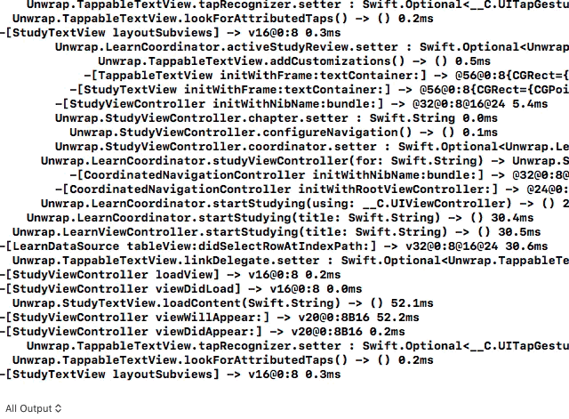

# SwiftTrace

Trace Swift and Objective-C method invocations of non-final classes in an app bundle or framework.
Think [Xtrace](https://github.com/johnno1962/Xtrace) but for Swift and Objective-C. You can also 
add "aspects" to member functions of non-final Swift classes to have a closure called before or after
a function implementation executes which in turn can modify incoming arguments or the return value!
Apart from the logging functionality, with binary distribution of Swift frameworks on the horizon perhaps
this will be of use in the same way "Swizzling" was in days of yore.



Note: none of these features will work on a class or method that is final or internal in 
a module compiled with whole module optimisation as the dispatch of the method
will be "direct" i.e. linked to a symbol at the call site rather than going through the
class' vtable. As such it is possible to trace calls to methods of a struct but only
if they are referenced through a protocol as they use a `witness table` which
can be patched.

SwiftTrace can be used with the Swift Package Manager or as a CocoaPod by
adding the following to your project's Podfile:
```swift
    pod 'SwiftTrace'
 ```
Once the project has rebuilt, import SwiftTrace into the application's AppDelegate and add something like the following to the beginning of
it's didFinishLaunchingWithOptions method:
```swift
    SwiftTrace.traceBundle(containing: type(of: self))
 ```
This traces all classes defined in the main application bundle.
To trace, for example, all classes in the RxSwift Pod add the following
```swift
    SwiftTrace.traceBundle(containing: RxSwift.DisposeBase.self)
 ```
This gives output in the Xcode debug console such as that above.

To trace a system framework such as UIKit you can trace classes using a pattern:
```swift
    SwiftTrace.traceClasses(matchingPattern:"^UI")
 ```
Individual classes can be traced using the underlying api:
```swift
    SwiftTrace.trace(aClass: MyClass.self)
```
Or to trace all methods of instances of a particular class including those of their superclasses
use the following:
```Swift
    SwiftTrace.traceInstances(ofClass: aClass)
```
Or to trace only a particular instance use the following:
```Swift
    SwiftTrace.trace(anInstance: anObject)
```
It is possible to trace methods of a structs or other types if they are messaged through
protools as this would then be indirect via what is called a `witness table`. Tracing
protocols is available at the bundle level where the bundle being traced is specified
using a class instance. They can be further filtered by an optional regular expression. 
For example, the following:
```Swift
SwiftTrace.traceProtocolsInBundle(containing: AClassInTheBundle.self, matchingPattern: "regexp")
```
For example, to trace internal calls made in the `SwiftUI` framework you can use the following:
```Swift
func application(_ application: UIApplication, didFinishLaunchingWithOptions launchOptions: [UIApplication.LaunchOptionsKey: Any]?) -> Bool {
    SwiftTrace.traceProtocolsInBundle(containing: UIHostingController<HomeView>.self)
    return true
}
```

Which traces are applied can be filtered using method name inclusion and exclusion regexps. 
```swift
    SwiftTrace.methodInclusionPattern = "TestClass"
    SwiftTrace.methodExclusionPattern = "init|"+SwiftTrace.defaultMethodExclusions
```
These methods must be called before you start the trace as they are applied during the "Swizzle" phase.
There is a default set of exclusions setup as a result of testing by tracing UIKit.
                      
    open class var defaultMethodExclusions: String {
        return """
            \\.getter| (?:retain|_tryRetain|release|_isDeallocating|.cxx_destruct|dealloc|description| debugDescription)]|initWithCoder|\
            ^\\+\\[(?:Reader_Base64|UI(?:NibStringIDTable|NibDecoder|CollectionViewData|WebTouchEventsGestureRecognizer)) |\
            ^.\\[(?:UIView|RemoteCapture) |UIDeviceWhiteColor initWithWhite:alpha:|UIButton _defaultBackgroundImageForType:andState:|\
            UIImage _initWithCompositedSymbolImageLayers:name:alignUsingBaselines:|\
            _UIWindowSceneDeviceOrientationSettingsDiffAction _updateDeviceOrientationWithSettingObserverContext:windowScene:transitionContext:|\
            UIColorEffect colorEffectSaturate:|UIWindow _windowWithContextId:|RxSwift.ScheduledDisposable.dispose| ns(?:li|is)_
            """
    }

If you want to further process output you can define your own custom tracing sub class:
```swift
    class MyTracer: SwiftTrace.Decorated {

        override func onEntry(stack: inout SwiftTrace.EntryStack) {
            print( ">> "+stack )
        }
    }
    
    SwiftTrace.swizzleFactory = MyTracer.self
 ```   
 As the amount of of data logged can quickly get out of hand you can control what is
 logged by combing traces with the optional `subLevels` parameter to the above functions.
 For example, the following puts a trace on all of UIKit but will only log calls to methods
 of the target instance and up to three levels of calls those method make:
 ```Swift
     SwiftTrace.traceBundle(containing: UIView.self)
     SwiftTrace.trace(anInstance: anObject, subLevels: 3)
 ```
 Or, the following will log methods of the application and calls to RxSwift they make:
 ```Swift
     SwiftTrace.traceBundle(containing: RxSwift.DisposeBase.self)
     SwiftTrace.traceMainBundle(subLevels: 3)
 ```
 If this seems arbitrary the rules are reasonably simple. When you add a trace with a
 non-zero subLevels parameter all previous traces are inhibited unless they are being
 made up to subLevels inside a method in the most recent trace or if they where filtered
 anyway by a class or instance (traceInstances(ofClass:) and trace(anInstance:)).

If you would like  to extend SwiftTrace to be able to log one of your struct types
there are two steps. First, extend the type to conform to SwiftTraceArg if it contains
only non-float types or SwiftTraceFloatArg of it contains only float types.
```Swift
extension TestStruct: SwiftTraceArg {}
```
Then, before the trace is called add a handler for the type which takes the following form:
```Swift
    SwiftTrace.Decorated.swiftTypeHandlers["SwiftTwaceApp.TestStruct"] = {
        SwiftTrace.Decorated.handleArg(invocation: $0, isReturn: $1, type: TestStruct.self)
    }
```
 Many of these API's are also available as a extension of NSObject which is useful
 when SwiftTrace is made available by dynamically loading bundle as in
 (InjectionIII)[https://github.com/johnno1962/InjectionIII].
 ```Swift
     SwiftTrace.traceBundle(containing: UIView.class)
     // becomes
     UIView.traceBundle()
     
     SwiftTrace.trace(inInstance: anObject)
     // becomes
     anObject.swiftTraceInstance()
 ```
 This is useful when SwiftTrace is made available by dynamically loading a bundle
 such as when using (InjectionIII)[https://github.com/johnno1962/InjectionIII]. Rather
 than having to include a CocoaPod, all you need to do is add SwiftTrace.h in the
 InjectionIII application's bundle to your bridging header and dynamically load the bundle.
 ```Swift
    Bundle(path: "/Applications/InjectionIII.app/Contents/Resources/iOSInjection.bundle")?.load()
 ```
 #### Benchmarking
 
 To benchmark an app or framework, trace it's methods then you can use one of the following:
 ```
    SwiftTrace.sortedElapsedTimes(onlyFirst: 10))
    SwiftTrace.sortedInvocationCounts(onlyFirst: 10))
 ```
#### Aspects

You can add an aspect to a particular method using the method's de-mangled name:
```swift
    print(SwiftTrace.addAspect(aClass: TestClass.self,
                      methodName: "SwiftTwaceApp.TestClass.x() -> ()",
                      onEntry: { (_, _) in print("ONE") },
                      onExit: { (_, _) in print("TWO") }))
 ```   
This will print "ONE" when method "x" of TextClass is called and "TWO when it has exited. The
two arguments are the Swizzle which is an object representing the "Swizzle" and the entry or 
exit stack. The full signature for the entry closure is:
```swift
       onEntry: { (swizzle: SwiftTrace.Swizzle, stack: inout SwiftTrace.EntryStack) in
 ```   
If you understand how [registers are allocated](https://github.com/apple/swift/blob/master/docs/ABI/RegisterUsage.md) to arguments it is possible to poke into the
stack to modify the incoming arguments and, for the exit aspect closure you can replace
the return value and on a good day log (and prevent) an error being thrown.

Replacing an input argument in the closure is relatively simple:
```swift
    stack.intArg1 = 99
    stack.floatArg3 = 77.3
 ```
Other types of argument a little more involved. They must be cast and String
takes up two integer registers.
```swift
    swizzle.rebind(&stack.intArg2).pointee = "Grief"
    swizzle.rebind(&stack.intArg4).pointee = TestClass()
 ```
In an exit aspect closure, setting the return type is easier as it is generic:
```swift
    stack.setReturn(value: "Phew")
 ```
When a function throws you can access NSError objects.
```swift
    print(swizzle.rebind(&stack.thrownError, to: NSError.self).pointee)
 ```
It is possible to set `stack.thrownError` to zero to cancel the throw but you will need to set
the return value.

If this seems complicated there is a property `swizzle.arguments` which can be used
`onEntry` which contains the arguments as an `Array` containing elements of type `Any`
which can be cast to the expected type. Element 0 is `self`.

#### Invocation interface

Now we have a trampoline infrastructure, it is possible to implement an invocation api for Swift:
```swift
    print("Result: "+SwiftTrace.invoke(target: b,
        methodName: "SwiftTwaceApp.TestClass.zzz(_: Swift.Int, f: Swift.Double, g: Swift.Float, h: Swift.String, f1: Swift.Double, g1: Swift.Float, h1: Swift.Double, f2: Swift.Double, g2: Swift.Float, h2: Swift.Double, e: Swift.Int, ff: Swift.Int, o: SwiftTwaceApp.TestClass) throws -> Swift.String",
        args: 777, 101.0, Float(102.0), "2-2", 103.0, Float(104.0), 105.0, 106.0, Float(107.0), 108.0, 888, 999, TestClass()))
 ```
In order to determine the mangled name of a method you can get the full list for a class 
using this function:
```swift
    print(SwiftTrace.methodNames(ofClass: TestClass.self))
 ```
There are limitations to this abbreviated interface in that it only supports Double, Float,
String, Int, Object, CGRect, CGSize and CGPoint arguments. For other struct types that
do not contain floating point values you can conform them to protocol `SwiftTraceArg`
to be able to pass them on the argument list or `SwiftTraceFloatArg` if they contain
only floats. These values and return values must fit into 32 bytes and not contain floats.

#### How it works
                      
A Swift `AnyClass` instance has a layout similar to an Objective-C class with some
additional data documented in the `ClassMetadataSwift` in SwiftMeta.swift. After this data
there is the vtable of pointers to the class and instance member functions of the class up to
the size of the class instance. SwiftTrace replaces these function pointers with a pointer
to a unique assembly language "trampoline" entry point which has destination function and
data pointers associated with it. Registers are saved and this function is called passing
the data pointer to log the method name. The method name is determined by de-mangling the
symbol name associated the function address of the implementing method. The registers are
then restored and control is passed to the original function implementing the method. 
 
Please file an issue if you encounter a project that doesn't work while tracing. It should
be 100% reliable as it uses assembly language trampolines rather than Swizzling like Xtrace.
Otherwise, the author can be contacted on Twitter [@Injection4Xcode](https://twitter.com/@Injection4Xcode). 
Thanks to Oliver Letterer for the [imp_implementationForwardingToSelector](https://github.com/OliverLetterer/imp_implementationForwardingToSelector) project adapted to set up the
trampolines. Thanks also  to [@twostraws](https://twitter.com/twostraws)'
[Unwrap](https://github.com/twostraws/Unwrap) and [@artsy](https://twitter.com/ArtsyOpenSource)'s
[eidolon](https://github.com/artsy/eidolon) used extensively during testing.

Enjoy!
